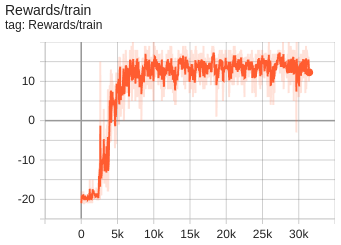
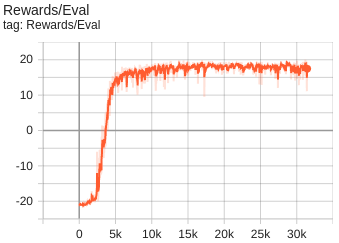
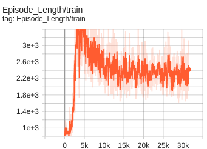
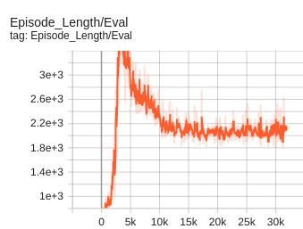
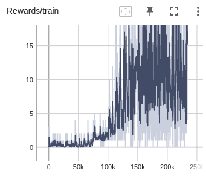
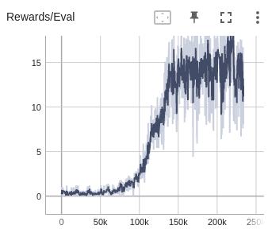
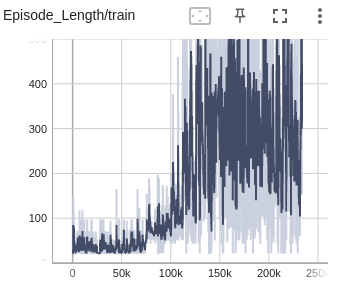
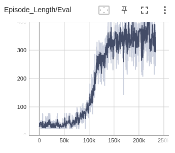

# Human_Level_Control_DRL_DQN

This repo is an implementation of the paper: 'Human-level control through deep reinforcement learning'

Link to the paper: https://arxiv.org/pdf/1709.06009.pdf 

## Results 
In this repo we train on the atari games of Pong and Breakout. The training and evaluation graphs are as follows: 

### Pong 

### Breakout

Resources used:

https://danieltakeshi.github.io/2016/11/25/frame-skipping-and-preprocessing-for-deep-q-networks-on-atari-2600-games/

https://github.com/openai/gym/blob/master/gym/wrappers/atari_preprocessing.py

